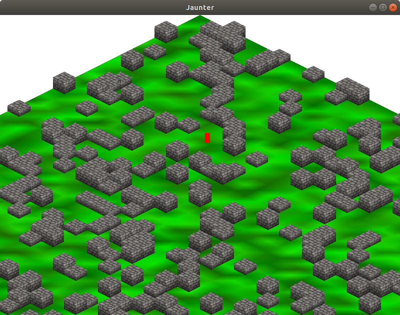

# IsometricSFML

A very basic isometric engine.

It was going to be a game called "Jaunter", so that name is peppered about, but the way it is right now is a good template for other games and projects.  
The structure isn't what I'd like it to be - I don't know what possessed me to put object creation in the Display class, but I'll fix it some day, probably.

## Download, Build, and Run

On Debian et al:

    sudo apt install libsfml-dev cmake make
    git clone --depth=1 https://github.com/phunanon/IsometricSFML.git
    cd IsometricSFML && mkdir build && cd build
    cmake ../src
    make
    ./Jaunter
